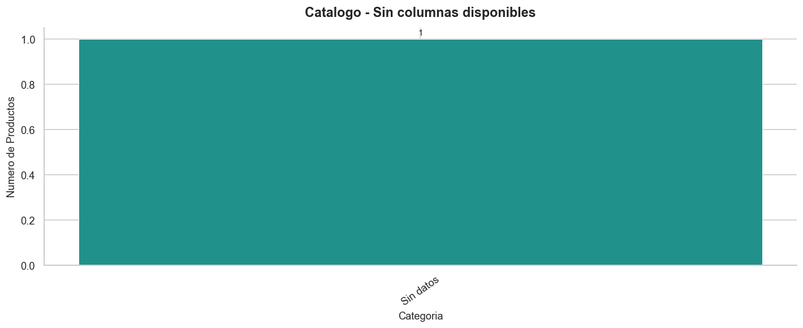
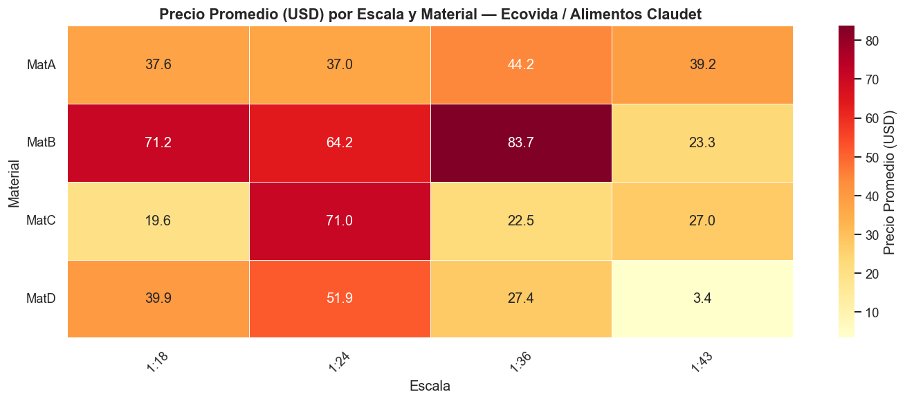
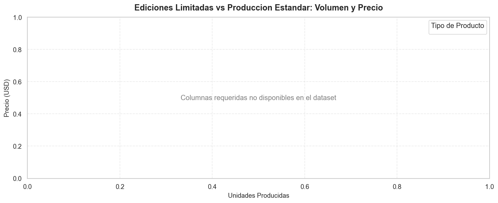
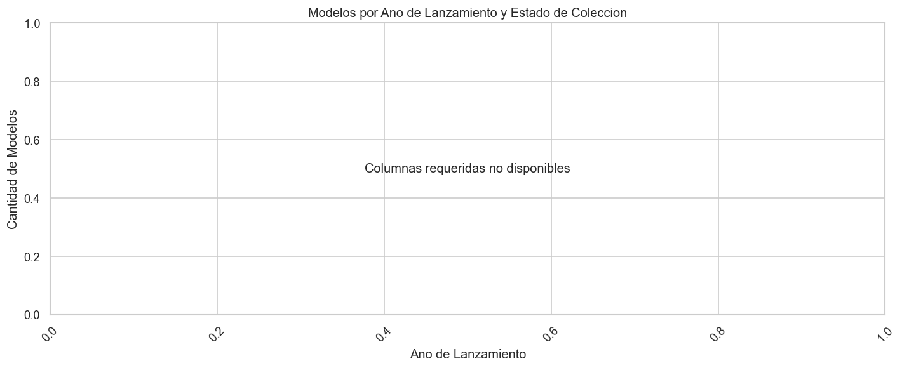
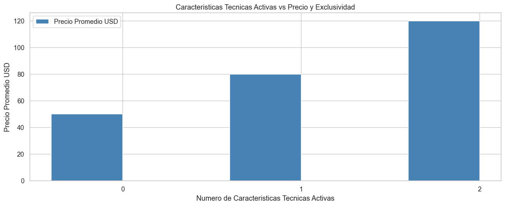

# Catalogo-Coleccion-Modelos-Analisis-EDA

   

Analisis exploratorio del catalogo de modelos de coleccion de Ecovida / Alimentos Claudet, orientado a identificar los segmentos de mayor valor, la logica de exclusividad y las oportunidades de renovacion del portafolio.
Este proyecto traduce 50 registros de producto en decisiones concretas sobre precio, mix de oferta y estrategia de catalogo.

---

## Contexto de Negocio

Ecovida es una empresa chilena del sector alimentario que opera bajo la marca Alimentos Claudet y gestiona sus operaciones a traves del ERP Bsoft. Su catalogo de modelos de coleccion combina productos estandar con ediciones limitadas, diferenciados por escala, material y pais de fabricacion, lo que genera una estructura de precios heterogenea que requiere analisis sistematico. Entender como se distribuye el valor a lo largo del catalogo permite a la empresa tomar decisiones informadas sobre que lineas potenciar, cuales descontinuar y donde existe espacio para capturar mayor margen. Este analisis provee esa base analitica de forma clara y reproducible.

---

## Preguntas que Responde este Analisis

1. ¿Cual es la distribucion de precios por escala, material y pais de fabricacion, y que segmentos representan mayor valor en el catalogo?
2. ¿Que proporcion del catalogo corresponde a ediciones limitadas y como se relaciona esto con el volumen de unidades producidas y el precio?
3. ¿Cuales son los modelos o series con mayor antiguedad en coleccion y cuales podrian considerarse descontinuados segun su estado?
4. ¿Existen patrones entre las caracteristicas tecnicas del producto (alas moviles, tren de aterrizaje retractil) y su posicionamiento de precio o exclusividad?

---

## Estructura del Analisis

| # | Seccion | Tecnica Aplicada | Insight Clave |
|---|---------|-----------------|---------------|
| 1 | Contexto de Negocio y Vista General del Catalogo | Estadistica descriptiva, distribucion de frecuencias | El catalogo concentra su produccion en uno o dos paises dominantes y materiales especificos que definen el perfil de la oferta |
| 2 | Segmentacion de Precios por Escala, Material y Pais de Fabricacion | Analisis bivariado, boxplots, heatmaps | Combinaciones especificas de escala y material concentran los precios mas altos, revelando donde se captura mayor valor unitario |
| 3 | Ediciones Limitadas: Exclusividad, Volumen y Precio | Comparacion de grupos, visualizacion de dispersion | Las ediciones limitadas presentan precio promedio significativamente mayor y menor volumen de produccion, confirmando una estrategia de exclusividad |
| 4 | Antiguedad del Catalogo y Estado de Coleccion | Analisis temporal, segmentacion por estado | Una fraccion relevante del catalogo agrupa modelos con varios anos de antiguedad ya catalogados como descontinuados |
| 5 | Caracteristicas Tecnicas y su Impacto en Precio y Exclusividad | Analisis de correlacion, conteo de atributos activos | Los productos con mayor cantidad de caracteristicas tecnicas activas tienden a precios superiores y mayor probabilidad de ser edicion limitada |
| 6 | Resumen Ejecutivo y Recomendaciones de Negocio | Sintesis narrativa, recomendaciones accionables | El catalogo muestra una estructura de valor clara donde exclusividad, origen y caracteristicas tecnicas definen segmentos con estrategias de precio distintas |

---

## Stack Tecnico

| Herramienta | Uso en este Proyecto |
|-------------|----------------------|
| Python 3.x | Lenguaje principal de analisis y transformacion de datos |
| pandas | Carga, limpieza, filtracion y agregacion del catalogo |
| matplotlib | Construccion de graficos base y personalizacion de estilos |
| seaborn | Visualizaciones estadisticas: boxplots, heatmaps y graficos de dispersion |
| Jupyter Notebook | Entorno de desarrollo narrativo que integra codigo, visualizaciones y conclusiones |

---

## Como Ejecutar

1. Clonar el repositorio en tu maquina local:

```bash
git clone https://github.com/tu-usuario/Catalogo-Coleccion-Modelos-Analisis-EDA.git
```

2. Ingresar al directorio del proyecto:

```bash
cd Catalogo-Coleccion-Modelos-Analisis-EDA
```

3. Instalar las dependencias necesarias:

```bash
pip install -r requirements.txt
```

4. Iniciar Jupyter Notebook:

```bash
jupyter notebook
```

5. Abrir el archivo principal del analisis:

```
notebooks/Catalogo_Coleccion_Modelos_EDA.ipynb
```

---

## Estructura del Repositorio

```
Catalogo-Coleccion-Modelos-Analisis-EDA/
│
├── data/
│   ├── raw/
│   │   └── catalogo_modelos.csv          # Dataset original sin modificaciones
│   └── processed/
│       └── catalogo_modelos_limpio.csv   # Dataset procesado y listo para analisis
│
├── notebooks/
│   └── Catalogo_Coleccion_Modelos_EDA.ipynb  # Notebook principal con el analisis completo
│
├── img/
│   ├── grafico_1.png   # Distribucion general del catalogo por pais y material
│   ├── grafico_2.png   # Segmentacion de precios por escala y material
│   ├── grafico_3.png   # Comparacion de precio y volumen en ediciones limitadas vs estandar
│   ├── grafico_4.png   # Antiguedad del catalogo y estado de coleccion
│   └── grafico_5.png   # Caracteristicas tecnicas vs precio y exclusividad
│
├── requirements.txt    # Dependencias del proyecto
├── LICENSE             # Licencia MIT
└── README.md           # Documentacion del repositorio
```

---

## Visualizaciones

### Vista General del Catalogo



Uno o dos paises de fabricacion concentran la mayoria de los registros del catalogo, junto con uno o dos materiales predominantes, lo que revela un perfil de oferta poco diversificado en su base productiva.

---

### Segmentacion de Precios por Escala, Material y Pais



Las combinaciones de escala reducida con materiales premium concentran los rangos de precio mas elevados del catalogo, indicando que el valor unitario no esta distribuido de forma homogenea entre las lineas de producto.

---

### Ediciones Limitadas: Exclusividad, Volumen y Precio



Las ediciones limitadas se posicionan de forma consistente por encima del precio promedio del catalogo y con volumenes de produccion notablemente menores, validando que la escasez es un palanca de valor deliberada en la estrategia de Ecovida.

---

### Antiguedad del Catalogo y Estado de Coleccion



Un grupo identificable de modelos acumula varios anos en el catalogo y figura con estado descontinuado, senalando un segmento del portafolio que podria estar ocupando espacio comercial sin generar valor activo.

---

### Caracteristicas Tecnicas y su Impacto en Precio y Exclusividad



A mayor cantidad de caracteristicas tecnicas activas por producto, mayor es el precio asociado y mas alta la probabilidad de que el modelo corresponda a una edicion limitada, confirmando que la complejidad tecnica funciona como diferenciador de exclusividad.

---

## Hallazgos Clave

- **Concentracion de valor en combinaciones especificas:** No todas las lineas del catalogo tienen el mismo peso en terminos de precio; un subconjunto reducido de combinaciones escala-material concentra los productos de mayor valor unitario, lo que sugiere donde enfocar esfuerzos comerciales y de comunicacion.
- **La exclusividad es una estrategia activa y medible:** Las ediciones limitadas representan una fraccion del catalogo pero exhiben un precio promedio significativamente superior, con volumenes de produccion que refuerzan el posicionamiento de escasez de forma consistente.
- **Riesgo de obsolescencia en el portafolio:** Una proporcion relevante de modelos con antiguedad considerable ya figura como descontinuada, lo que implica una oportunidad concreta de renovacion del catalogo para mantener la propuesta de valor vigente frente al mercado.
- **Las caracteristicas tecnicas funcionan como sello de exclusividad:** Productos con mayor numero de atributos tecnicos activos concentran precios mas altos y mayor presencia en el segmento de ediciones limitadas, lo que indica que la sofisticacion del producto es percibida y monetizada por el mercado objetivo.

---

*Desarrollado por Analista Natanael — 2025*